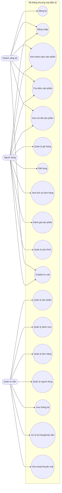
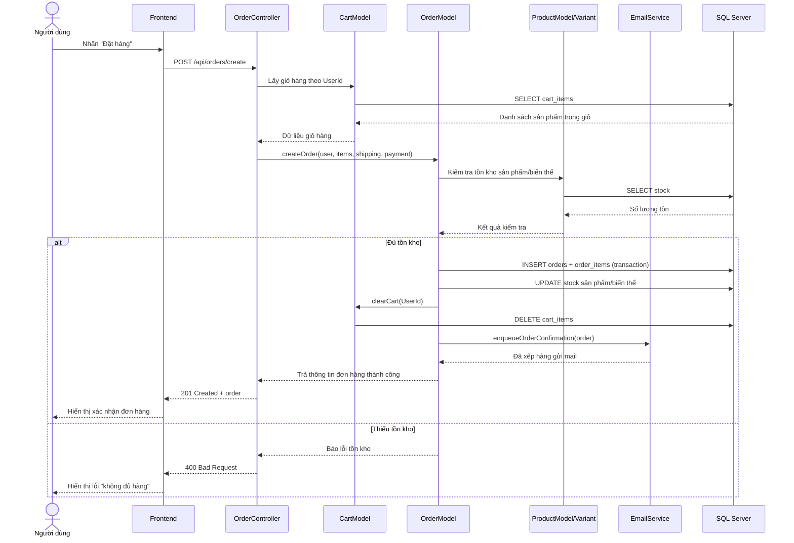
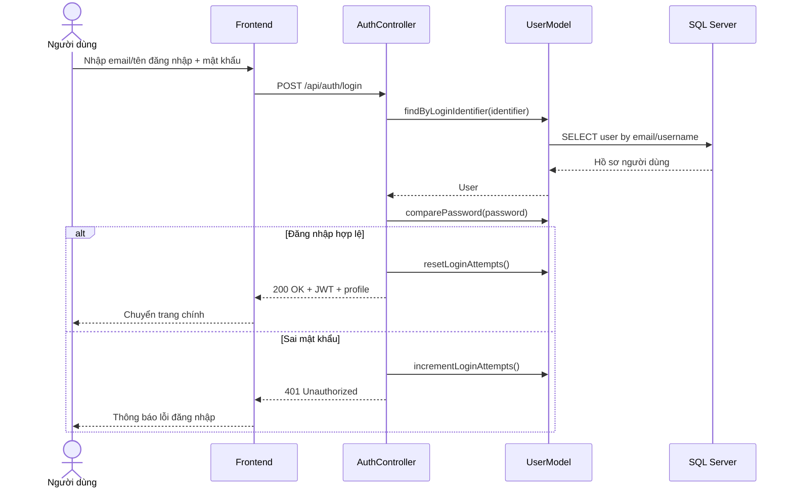
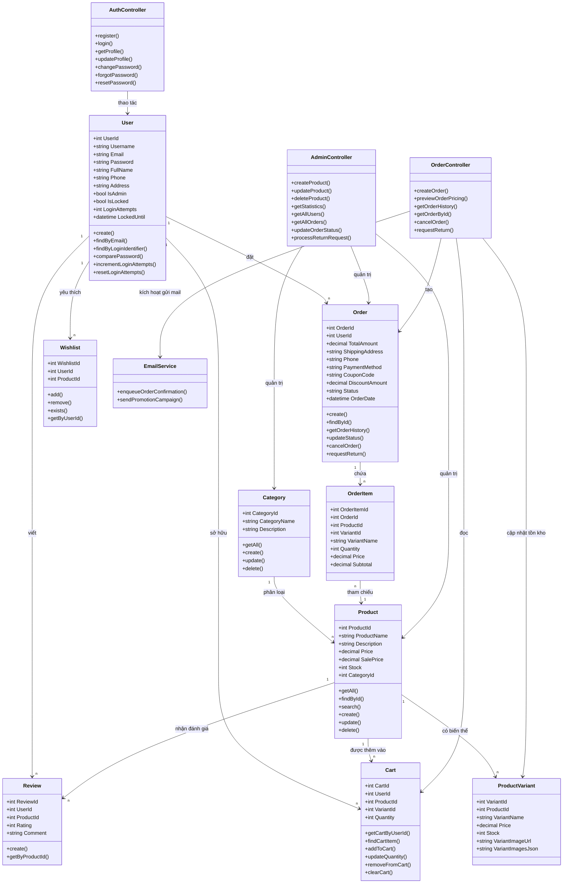
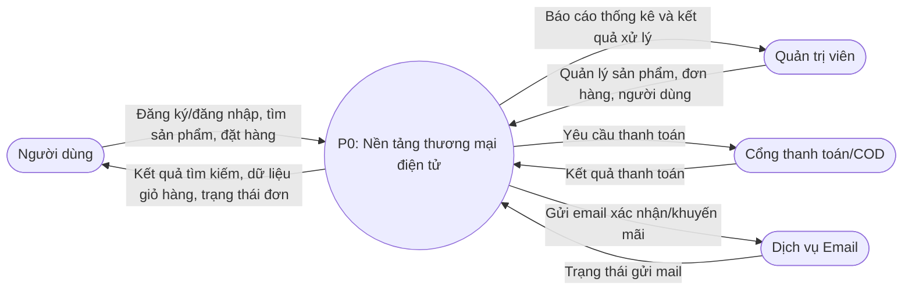
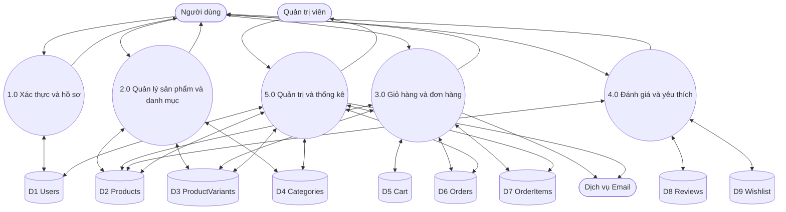
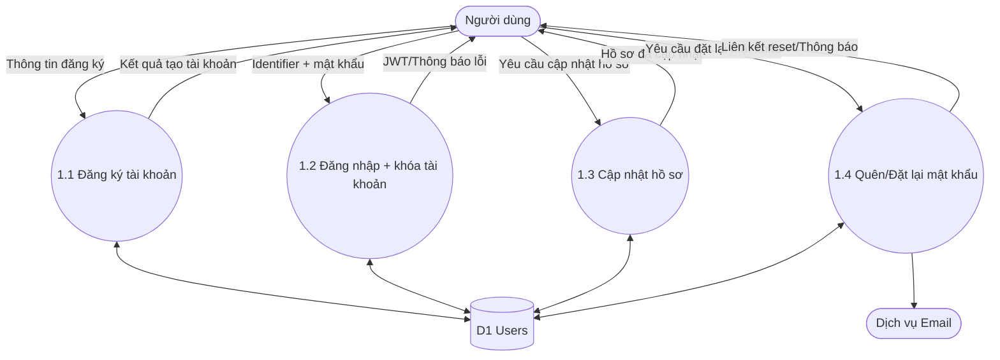
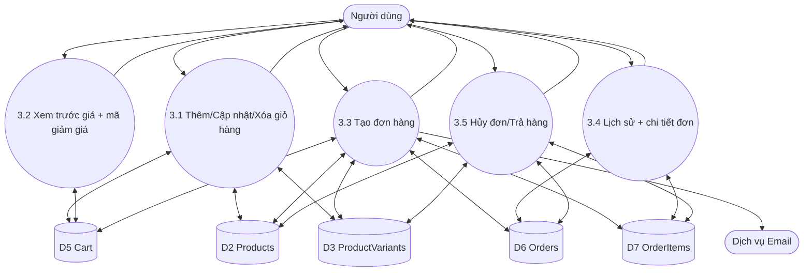
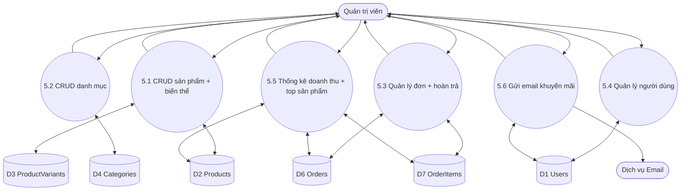

# PHÂN TÍCH THIẾT KẾ UML - HỆ THỐNG THƯƠNG MẠI ĐIỆN TỬ

Tài liệu này đã được chuẩn hóa theo đúng 4 mục bạn yêu cầu:

1. Biểu đồ Use Case
2. Biểu đồ tuần tự
3. Biểu đồ lớp
4. Biểu đồ phân cấp chức năng

Phần DFD mức 0, 1, 2 được giữ lại ở phụ lục để phục vụ báo cáo chi tiết luồng dữ liệu.

## 1. Biểu đồ Use Case

## 2. Biểu đồ tuần tự

### 2.1 Tuần tự đặt hàng

### 2.2 Tuần tự đăng nhập

## 3. Biểu đồ lớp

## 4. Biểu đồ phân cấp chức năng

```mermaid
flowchart TD
    F0([Hệ thống thương mại điện tử])

    F0 --> F1([1. Quản lý tài khoản])
    F0 --> F2([2. Quản lý sản phẩm])
    F0 --> F3([3. Quản lý giỏ hàng và đơn hàng])
    F0 --> F4([4. Tương tác người dùng])
    F0 --> F5([5. Quản trị hệ thống])

    F1 --> F11([1.1 Đăng ký])
    F1 --> F12([1.2 Đăng nhập/Đăng xuất])
    F1 --> F13([1.3 Hồ sơ cá nhân])
    F1 --> F14([1.4 Quên/Đặt lại mật khẩu])

    F2 --> F21([2.1 Danh mục sản phẩm])
    F2 --> F22([2.2 Danh sách sản phẩm])
    F2 --> F23([2.3 Chi tiết sản phẩm])
    F2 --> F24([2.4 Tìm kiếm/Lọc/Sắp xếp])

    F3 --> F31([3.1 Thêm/Cập nhật/Xóa giỏ hàng])
    F3 --> F32([3.2 Xem phí và mã giảm giá])
    F3 --> F33([3.3 Tạo đơn hàng])
    F3 --> F34([3.4 Lịch sử/chi tiết đơn])
    F3 --> F35([3.5 Hủy đơn/Trả hàng])

    F4 --> F41([4.1 Đánh giá sản phẩm])
    F4 --> F42([4.2 Danh sách yêu thích])
    F4 --> F43([4.3 Chatbot tư vấn])

    F5 --> F51([5.1 Quản lý người dùng])
    F5 --> F52([5.2 Quản lý sản phẩm và biến thể])
    F5 --> F53([5.3 Quản lý danh mục])
    F5 --> F54([5.4 Quản lý đơn hàng/hoàn tiền])
    F5 --> F55([5.5 Thống kê doanh thu])
    F5 --> F56([5.6 Gửi email khuyến mãi])
```

## 5. Phụ lục: DFD mức 0, 1, 2

### 5.1 DFD mức 0 (Context Diagram)

### 5.2 DFD mức 1

### 5.3 DFD mức 2 - Quy trình 1.0 (Xác thực và hồ sơ)

### 5.4 DFD mức 2 - Quy trình 3.0 (Giỏ hàng và đơn hàng)

### 5.5 DFD mức 2 - Quy trình 5.0 (Quản trị và thống kê)

## 6. Kết luận mức độ đầy đủ

- Với yêu cầu 4 mục UML (Use Case, tuần tự, lớp, phân cấp chức năng): tài liệu hiện tại đã đầy đủ.
- Nếu giảng viên yêu cầu thêm phân tích luồng dữ liệu, phần phụ lục DFD mức 0/1/2 đã sẵn sàng.
- Có thể tách mỗi biểu đồ thành một hình riêng trong báo cáo để dễ đánh số hình và thuyết minh.
